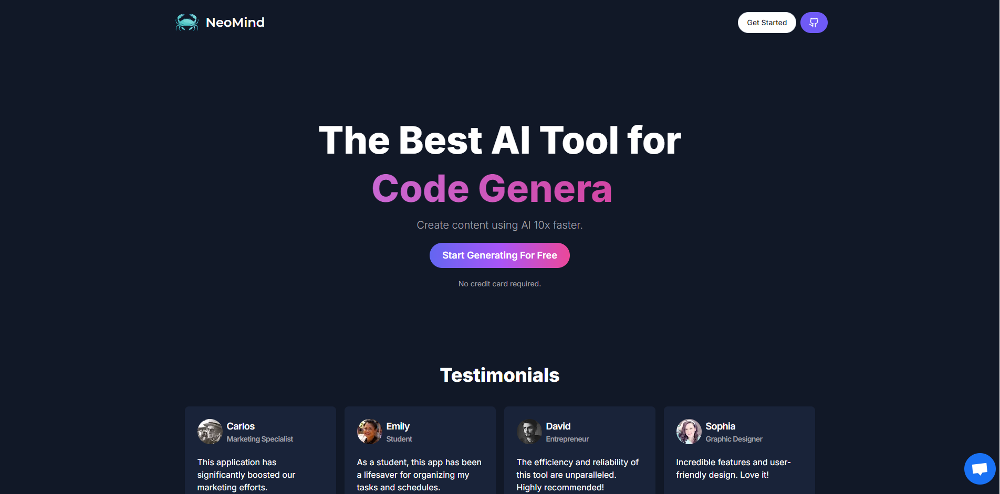

### NeoMind

Powerful SaaS AI platform offering chatbot services, image generation, code creation, video production, and music composition. Tailored for diverse use cases, it simplifies content creation and boosts efficiency. Ideal for businesses and creators seeking AI-driven innovation.

### Preview



### <a name="table">Table of Contents</a>

1. [Tech Stack](#tech-stack)
2. [Features](#features)
3. [Getting Started](#getting-started)
4. [Feedback](#feedback)
5. [Contributors](#contributors)

### <a name="tech-stack">Tech Stack</a>

- Next.js
- Prisma
- Stripe
- Crisp
- Clerk
- Aiven - MySQL
- OpenAI API
- Replicate
- Aiven
- HTML5
- CSS3
- React.js
- shadcn
- Tailwind CSS

### <a name="features">Features</a>

- **Limited Free Generations:** Users can generate up to 5 free outputs (text, images, code, videos, or music) before needing to upgrade for unlimited access.

- **Customer Support:** Dedicated 24/7 customer support to assist with queries, technical issues, and platform guidance.

- **Multi-Content Generation:** Offers seamless generation of chatbots, images, code, videos, and music, all from a single platform.

- **User Authentication:** Secure sign-in and sign-up options with email/password or social logins to ensure user data safety and accessibility.

- **Subscription Plans:** Flexible subscription options tailored to individual needs, offering cost-effective solutions for unlimited content generation.

- **Analytics Dashboard:** A detailed dashboard to track usage, monitor generation limits, and analyze generated content trends.

- **Collaboration Tools:** Allow teams to collaborate on content generation projects in real-time with shared workspaces.

- **Security Features:** Protect account with encryption and two-factor authentication for added security.

- **Responsive Design:** Follows responsive design principles to ensure optimal user experience across devices, adapting seamlessly to different screen sizes and resolutions.

### <a name="getting-started">Getting Started</a>

### Prerequisites

- [Git](https://git-scm.com/)
- [Node.js](https://nodejs.org/en)
- [npm](https://www.npmjs.com/) (Node Package Manager)

### Cloning

1. **Cloning:** 

    Run the following command in your terminal or command prompt to clone the repository to your local machine:

    ```bash
    git clone https://github.com/theankushshah/neomind.git
    ```

2. **Navigate to the Directory:** 
    
    Once cloned, navigate into the project directory using the `cd` command:

    ```bash
    cd neomind
    ```

### Download

1. **Download ZIP Code folder:** 

    Unzip the folder in your machine.

2. **Navigate to the Downloaded Directory:** 

    Open your code editor and open the unzipped folder in it then:

    ```bash
    cd /path/to/downloaded/folder
    ```

### Cloning & Download

1. **Dependencies Installation:**

    ```bash
    npm install
    ```

2. **Environment Variables & Database Setup:** 

    Create a new file named `.env` in the root of your project and add the following content:

    ```env
    NEXT_TELEMETRY_DISABLED=1

    NEXT_PUBLIC_CLERK_PUBLISHABLE_KEY=
    CLERK_SECRET_KEY=

    NEXT_PUBLIC_CLERK_SIGN_IN_URL=/sign-in
    NEXT_PUBLIC_CLERK_SIGN_UP_URL=/sign-up
    NEXT_PUBLIC_CLERK_AFTER_SIGN_IN_URL=/dashboard
    NEXT_PUBLIC_CLERK_AFTER_SIGN_UP_URL=/dashboard

    OPENAI_API_KEY=

    REPLICATE_API_TOKEN=

    DATABASE_URL=

    STRIPE_API_SECRET_KEY=
    STRIPE_WEBHOOK_SECRET=

    NEXT_PUBLIC_CRISP_WEBSITE_ID=
    ```

    Replace the placeholder values with your actual Clerk, OpenAI, Replicate, Stripe, Crisp & Database credentials. You can obtain these credentials by signing up on the [Clerk website](https://clerk.com), [OpenAI website](https://platform.openai.com), [Replicate website](https://replicate.com), [Aiven website](https://aiven.io), [Stripe website](https://stripe.com) and [Crisp website](https://crisp.chat)

3. **Database Run:**

    Run the following command to run the database:

    ```bash
    npx prisma generate
    npx prisma db push
    npx prisma studio
    ```

    Open the ORM in your browser to view the database.

4. **Running:**

    ```bash
    npm run dev
    ```

    Open [http://localhost:3000](http://localhost:3000) in your browser to view the project.

5. **Start Coding:** 

    Feel free to edit the code according to your requirements. 

6. **Testing**

    ```bash
    npm test
    ```

7. **Build for Production**

    ```bash
    npm run build
    ```

### Github

1. **Initialize a New Git Repository:**

    ```bash
    git init
    ```

2. **Stage and Commit the Code:**

    ```bash
    git add .
    git commit -m "Initial commit"
    ```

3. **Create a New Repository on GitHub:**

    Do not initialize the new repository with a README, .gitignore, or license.

4. **Link Local Repository to GitHub:**

    ```bash
    git remote add origin https://github.com/username/new-repo.git
    ```

    Replace https://github.com/username/new-repo.git with your actual repository URL.

5. **Push Code to GitHub:**

    ```bash
    git branch -m main
    git pull origin main
    git push -u origin main
    ```

6. **Deployment:** 
    
    Deploy the application to your preferred hosting platform to make it accessible online.

### Forking

1. **Forking:** 

    Run the following command in your terminal or command prompt to fork the repository to your local machine:

    ```bash
    git clone https://github.com/your-username/neomind.git
    ```

2. **Navigate to the Directory:** 

    Once cloned, navigate into the project directory using the `cd` command:

    ```bash
    cd neomind
    ```

3. **Start Coding:** 

    Make the additions & desired changes to the code.

4. **Commit & Push Your Changes to Your Fork:** 

    Once cloned, navigate into the project directory using the `cd` command:

    ```bash
    git add .
    git commit -m ""
    git pull origin main
    git push -u origin main
    ```

5. **Create a Pull Request:**

- Go to your forked repository on GitHub
- Click the "Compare & pull request" button.
- Review your changes and write a clear description of your contribution.
- Click "Create pull request"

    **I will review your pull request and decide whether to merge your changes into my repository or not**

### <a name="feedback">Feedback</a>

You might encounter some bugs while using this app. You are more than welcome to contribute. Just submit changes via pull request and I will review them before merging. Make sure you follow community guidelines.

### <a name="contributors">Contributors & Main</a>

- Ankush Shah (ankushsahvlogs@gmail.com)
- Haven Futures (support@havenfutures.com) (Main)

Happy coding!